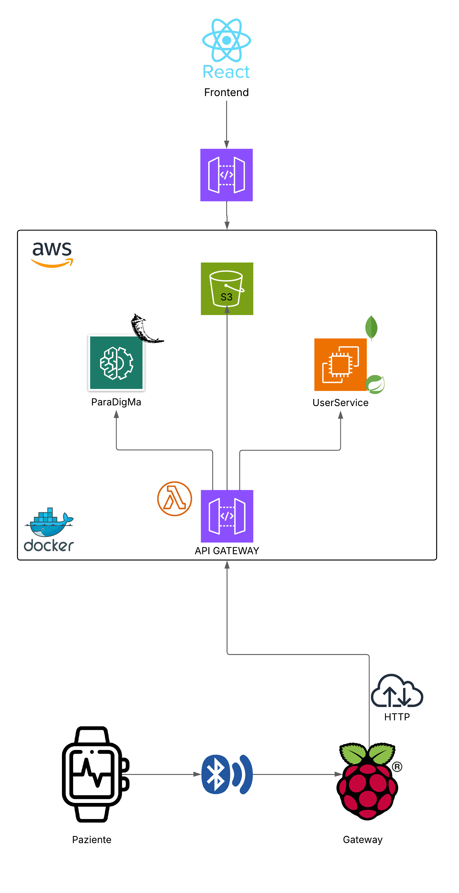

# Tremor Monitoring: Parkinson's Disease

## Panoramica

Questo progetto nasce per fornire un supporto al personale sanitario per il monitoraggio a distanza delle condizioni di un paziente domiciliarizzato
affetto dal disturbo di Parkinson.

Durante la realizzazione, i punti chiave che hanno poi influenzato la scelta dell'architettura sono stati:
- L'attenzione al paziente: rendere l'applicazione il meno invasiva ed il meno onerosa possibile a livello di interazione umana.
- Creare una struttura facilmente scalabile, sia orizzontalmente che verticalmente, favorendo il disaccoppiamennto più completo tra le varie componenti
- Fornire una struttura sicura, in quanto a che vedere con dati sensibili
- Garantire ad un medico che si interfaccia con l'applicazione di poter modificare le funzioni in base a varie esigenze diagnostiche.

Per poter sviluppare un' architettura del genere, i dati vengono prelevati tramite sensori **IMU** (Inertial MeasurementSensors) e attraverso il **BLE** (Bluetooth Low Energy), trasmessi ad un *raspberry Pi 5*, il quale si occupa della conversione e preparazione dei dati per l'algoritmo di Machine Learning. Questi dati sono poi passati ad una piattaforma cloud (**AWS**), dove risiedono oltre all'algoritmo di intelligenza artificiale, anche i microservizi per la gestione utenti e l'interfaccia frontend

Per la persistenza dei dati forniti dai sensori, e i risultati dell'inferenza, si è scelto di sfruttare il servizio cloud **S3** (Simple storage service), per disaccoppiare l'accesso dei dati, dall'inferenza in sé.

## Architettura generale

L'architettura si basa sull'utilizzo di microservizi, indipendenti, modulari e scalabili. Questi risiedono sull'infrastruttura cloud e l'accesso è fornito dai routing di **API GATEWAY**, il quale sfrutta anche il paradigma serverless (**Lambda functions**) per determinate operazioni.
Il tutto è stato poi containerizzato tramite Docker.

### Backend
- **UserService**: responsabile per la  gestione utenti. Fornisce operazioni CRUD sulle due entità principali della soluzione, cioè *Doctor* e *Patient*. Inoltre gestisce  registrazione, autenticazione e autorizzazione per gli utenti per cui è predisposto il servizio (*Doctor*).
-**SmartWatchService**: servizio installato localmente sul dispositivo, il quale tramite BLE si occupa di comunicare col raspberry Pi, responsabile dell'invio dei dati sul cloud
-**BLEserver**: servizio installato localmente sul raspberry, si occupa di fornire un server per la ricezione dei dati sensoriali, la conversione in un formato dati valido e l'invio di questi sul database remoto (*S3*)
-**TremorAnalysis**: 
